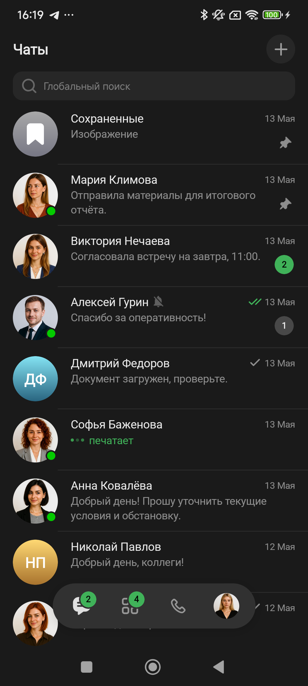
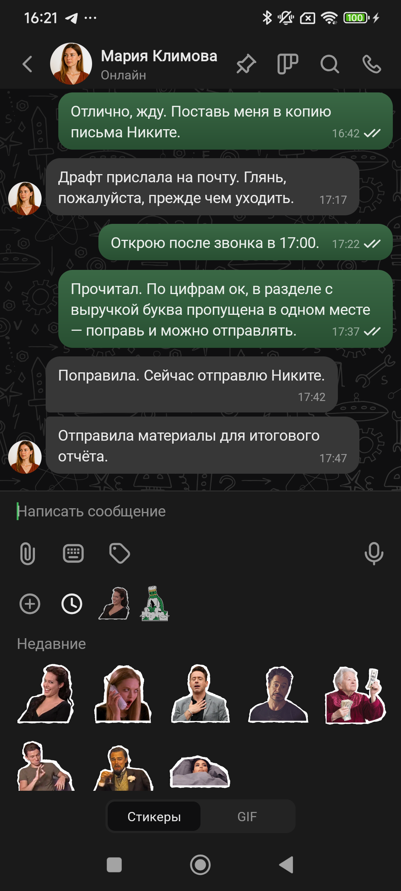
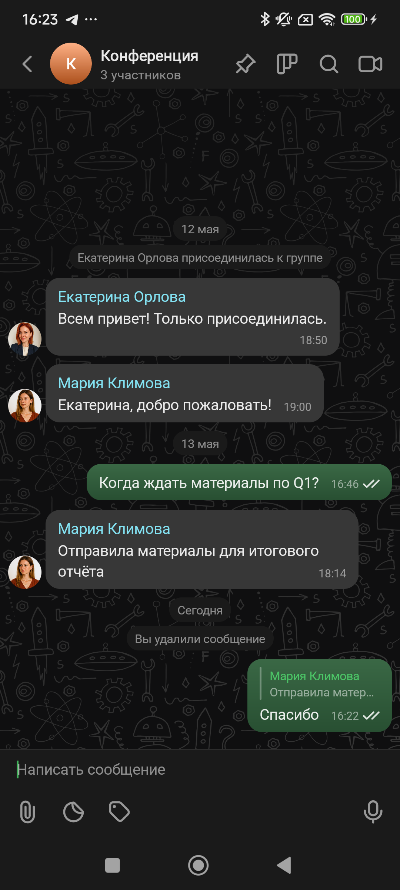
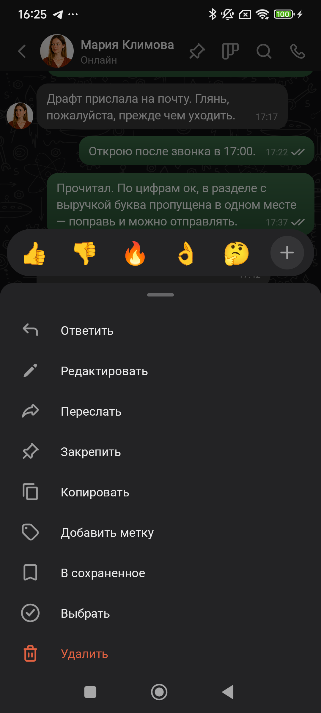
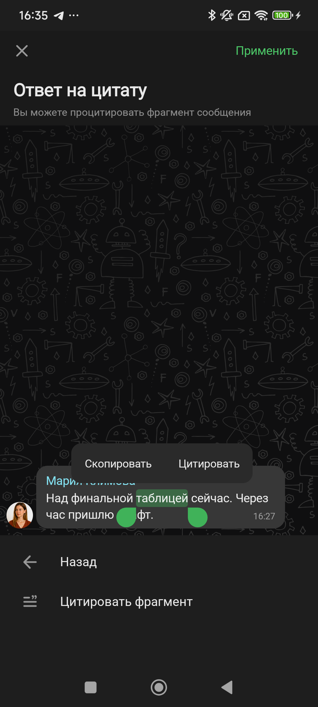
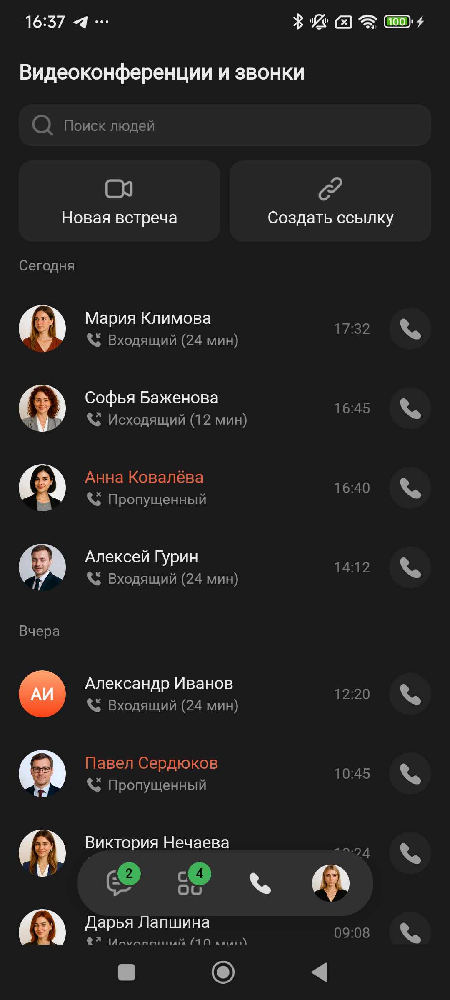
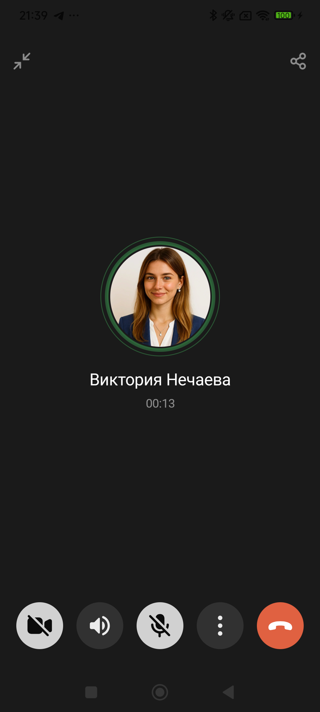
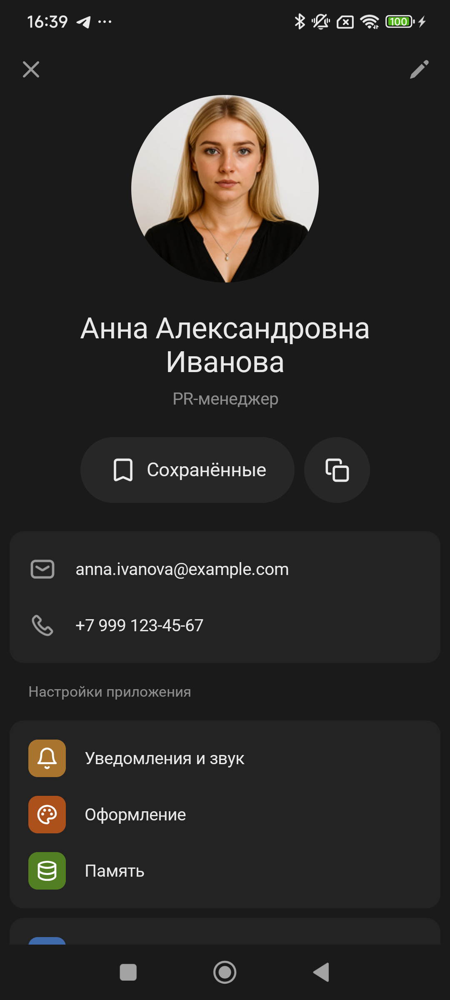

# android-template

Каркас Android-мессенджера для тестирования дизайн-гипотез. Подключает компоненты из соседнего репо `../android-components` через Gradle composite build.

---

## 📖 О проекте

Прототипный шаблон поверх [android-components](https://github.com/frisbeeaidesigners-max/Components-android-template) для быстрой проверки UX-идей и дизайн-сценариев. Использует библиотеку UI-компонентов через Gradle composite build, поддерживает 5 брендов и переключение тем в рантайме. Все данные — JSON-mock в `app/src/main/assets/mock/`.

В состав входят:

- **4 вкладки** — Чаты, Пространства, Звонки, Профиль (последний — fullscreen-оверлей)
- **Полнофункциональный экран открытого чата** — bubbles `Text` / `Media` / `Voice` / `Link` / `CallMeet`, системные сообщения, reply, edit, реакции, selection mode, quote-reply (in-place + fullscreen picker), контекстное меню, swipe-to-reply
- **MessagePanel** с текстом, голосом (mock-запись), вложениями, стикерами и гифами
- **5 брендовых тем** через `DSBrand` (`foxtrot` / `tango` / `sierra` / `kilo` / `love`) — переключаются параметром `-Pbrand=`
- **Adaptive launcher icon** + кастомный splash с capitalized codename'ом бренда
- **Composite build** с android-components — никаких дубликатов компонентов

---

## 🖼️ Скриншоты

### Чаты



Главный экран — `ChatListHost` со всеми типами превью: `Text`, `Media`, `Voice`, `Group`, статусами отправки (`DELIVERED`/`READ`), счётчиками непрочитанного, mention/pin/reaction бейджами, аватарками с online-индикатором.

### Личный чат + панель ввода



P2P-чат с собеседником: header с подписью «Онлайн», текстовые bubbles с group-corner'ами по same-sender грouping'у, `MessagePanel` с раскрытым стикер-picker'ом (пакеты `pack1` / `pack2` из синканных assets).

### Групповой чат



Групповой чат: sender name над SOMEONE-bubbles, аватарка на последнем бабле от того же отправителя, системные сообщения (`Joined`, дата-разделители «12 мая» / «Сегодня»), reply с цитатой-snapshot'ом, placeholder удалённого сообщения («Вы удалили сообщение»).

### Контекстное меню + реакции



Long-press по сообщению → `ContextMenuOverlay` поверх UI: пилюля реакций сверху (тап → toggle), полное меню действий снизу (Ответить / Редактировать / Переслать / Закрепить / Копировать / Добавить метку / В сохранённое / Выбрать / Удалить).

### Пикер цитаты (fullscreen)



Fullscreen-режим выбора фрагмента сообщения для quote-reply: выделение текста handles, floating-меню `Copy` / `Цитировать` над bubble, нижняя кнопка `Цитировать фрагмент`, тулбар `Применить` / X сверху.

### Звонки



Вкладка «Видеоконференции и звонки»: header `Main(mode=CHATS, onPlusClick=null)` с поиском людей. Закреплённый ряд action-плиток («Новая встреча» / «Создать ссылку») остаётся на месте при скролле. Список — `LazyColumn` со sticky-датами; строки с аватарками, иконкой типа звонка (incoming/outgoing/end-call-filled), временем, кнопкой call. Missed — `dangerDefault()` для имени.

### Исходящий звонок (P2P)



P2P-звонок: тонкий диспетчер `OutgoingCallScreen` → `P2POutgoingScreen` (fade-in fullscreen, без Lobby). Centre — аватарка counterpart-а 120dp в `P2PSpeakingIndicator` (3 кольца, аудио-envelope анимация старт на 0:02 таймера); под ней имя `title7R 22sp` + статус (`Вызов...` 2s, потом MM:SS). Header — только Collapse + Share, иконки `white50` в state 1 без видео / `white100` если активно. Bottom — 5 кнопок (Camera / Speaker / Mic / Dots / End-call) через общий `CallBottomBar` из `CallChrome.kt`. Long-tap по аватарке → имитация «counterpart включил камеру» → fullscreen аватарка counterpart-а + PiP self-видео 100×150dp при self-камере on. Group/BrandMeet идут другой веткой — `LobbyInCallScreen` с modal bottom sheet → InCall slide-in.

### Профиль



Fullscreen-оверлей (не вкладка): карточка с аватаром, имя/должность, контакты, секция настроек (`ButtonHost`/`InputField` из `:components/`). Тап «Edit» — отдельный `ProfileEditScreen` поверх с формой редактирования.

---

## ✨ Возможности

### Пять брендов

| Кодовое имя | Цвет | Акцент (светлая) | Акцент (тёмная) |
|-------------|------|------------------|------------------|
| **Foxtrot** 🟢 | зелёный | `#40B259` | `#40B259` |
| **Tango** 🔵 | синий | `#3E87DD` | `#3886E1` |
| **Sierra** 🟡 | золотой | `#C7964F` | `#C4944D` |
| **Kilo** 🔴 | красный | `#EA5355` | `#E9474E` |
| **Love** 🟣 | фиолетовый | `#7548AD` | `#7548AD` |

Бренд задаётся при сборке: `-Pbrand=<codename>` (default — `foxtrot`). Все цветовые схемы — через `DSBrand.*ColorScheme(isDark)` из `:components`. Тема (light/dark) переключается app-level — кнопка `+` в хедере «Чатов» работает как dev-тоггл.

### Что реализовано

| Раздел | Описание |
|--------|----------|
| **Чаты** | P2P-список, превью lastMessage (`Text`/`Media`/`Voice`/`Group`/`Draft`/`Typing`), статусы (`DELIVERED`/`READ`), бейджи (count, mention, pin, reaction). Online-индикатор на аватарках. |
| **Пространства** | Аналогичный список Group-/Channel-чатов с переключением space'а через bottom-sheet. |
| **Открытый чат** | bubbles `Text`/`Media`/`Voice`/`Link`/`CallMeet` через `:components`, same-sender grouping (FIRST/MIDDLE/LAST), reply-block с tap-to-jump и pulse-подсветкой оригинала, системные сообщения. |
| **MessagePanel** | Текст с многострочкой, голосовая запись (mock по таймеру + синтетический waveform), вложения (5 demo-картинок), стикеры (pack1/pack2), гифы. |
| **Voice** | Отправка с длительностью на хосте, mock-playback (play/pause/seek по waveform, тикер 50мс), один активный баббл на чат, swipe-reply и context-menu. |
| **Reply** | Snapshot переживает удаление оригинала. Swipe-to-reply влево по баблу, индикатор центрируется между bubble.right и screen.right через `OnLayoutChangeListener`. |
| **Edit** | На свои Text/Media. Media → Text конверсия при empty attachments. EditContext mutual-exclusive с reply. |
| **Selection mode** | Long-press → multi-select. `SelectionActionBar` по Figma (88dp ячейки, tinted-круг 48dp, danger для Delete). |
| **Quote-reply** | V1 in-place (long-press → Copy/Цитировать), V2 fullscreen picker с tap-to-jump, MatchResult-валидацией и pulse-подсветкой fragment'а. |
| **Реакции** | Под баблом, toggle через меню или тап по существующей. |
| **Удаление** | `Message.System(MessageDeleted)`-placeholder вместо filter'а. «Вы удалили…» / «Автор удалил(а)…» |
| **Звонки** | Action-плитки + sticky-даты + строки с типом/временем/кнопкой. См. соответствующий скриншот. |
| **Исходящий звонок** | `OutgoingCallScreen` — тонкий диспетчер. **P2P**: fade-in fullscreen, аватарка counterpart-а + `P2PSpeakingIndicator` (3 кольца с аудио-envelope), 4 состояния камер (off×off / on×off / off×on / on×on с PiP 100×150dp). **Group/BrandMeet**: Lobby modal sheet → InCall slide-in справа с параллельными анимациями. Запись в историю звонков на end-call (с `durationMs`). Bubble `CallMeet` показывает «HH:mm, 2 мин». |
| **Профиль** | ProfileScreen + ProfileEditScreen как fullscreen-оверлеи. |
| **Splash** | Кастомный launch-screen с capitalized codename'ом бренда. Каскадный fadeOut: text → bg, gated на готовность UI. |
| **Launcher icon** | Adaptive icon из единого SVG для всех брендов. |

---

## 📂 Структура модулей

```
android-template/
├── app/                       # Entrypoint, MainActivity, MainScaffold, SplashOverlay
├── core/
│   ├── model/                 # Pure-Kotlin data классы (без android-зависимостей)
│   ├── data/                  # MessengerRepository, MockRepositoryImpl, JSON-парсинг
│   ├── ui/                    # AppTheme, хосты компонентов, форматтеры
│   └── navigation/            # NavRoute, TabRoute (legacy — табы на offset-layout)
├── feature/
│   ├── chats/                 # Список P2P-чатов
│   ├── spaces/                # Список Group/Channel-чатов с пространствами
│   ├── calls/                 # Вкладка звонков
│   ├── profile/               # Профиль и редактирование
│   └── chatdetail/            # Открытый чат, contextMenu, quote-picker
├── build-logic/               # Convention-плагины (android.library, android.feature)
├── docs/
│   └── screenshots/           # README-скриншоты
└── CLAUDE.md                  # Подробные конвенции, gotcha, performance notes
```

Правила зависимостей: `:feature:*` не зависят друг от друга (только через `:core:navigation`), `:core:model` — без android-зависимостей.

---

## 🛠️ Сборка

### Требования

- **Android SDK** (compileSdk 34, minSdk 26)
- **JDK 17** (рекомендуется JBR из Android Studio)
- Соседние локальные клоны: `../android-components`, `../icons-library`

> **Имена GH-репо vs локальных папок.** На GitHub репозиторий компонентов называется `Components-android-template`, но Gradle composite build ищет его по локальному пути `../android-components`. Клонировать так:
>
> ```bash
> git clone https://github.com/frisbeeaidesigners-max/Components-android-template.git android-components
> ```

### Команды

```bash
# Default бренд — foxtrot
./gradlew :app:assembleDebug

# Конкретный бренд
./gradlew :app:assembleDebug -Pbrand=tango

# Установка на устройство
./gradlew :app:installDebug -Pbrand=sierra

# Release-сборка (подписана debug-keystore'ом для локальной установки)
./gradlew :app:assembleRelease -Pbrand=foxtrot

# Тесты
./gradlew :core:data:testDebugUnitTest
```

### Технологический стек

- **Kotlin** 1.9.22, **AGP** 8.2.2
- **Jetpack Compose** (BOM 2024.02.00), **Material 3** + Material 1 (для `rememberRipple(color=)`)
- **Compose Compiler** 1.5.10
- **kotlinx-serialization**, **androidx.navigation:compose**

---

## 🔗 Связанные репозитории

- **[Components-android-template](https://github.com/frisbeeaidesigners-max/Components-android-template)** (локально `../android-components`) — UI-библиотека: 24+ компонента, DSBrand, DSTypography, MCP-сервер.
- **icons-library** (локально `../icons-library`) — SVG-иконки (389 шт.), цветовые токены.

---

## 📄 Подробности

Полные конвенции, gotcha, performance-заметки и список реализованных фич с привязкой к файлам — в [`CLAUDE.md`](CLAUDE.md).
